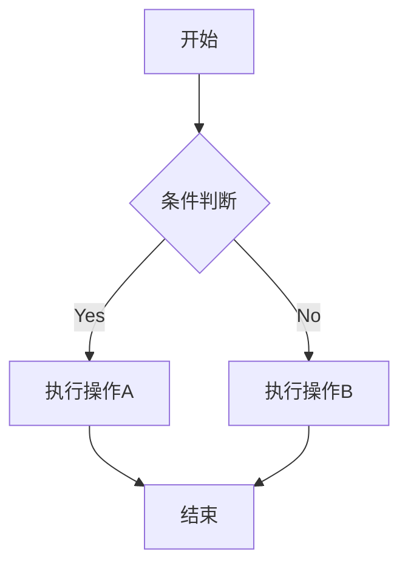
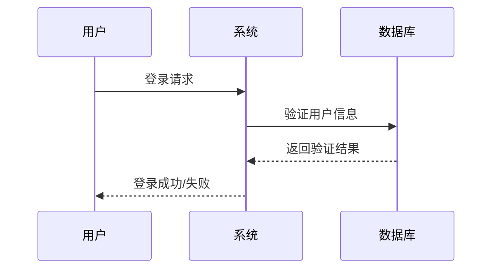
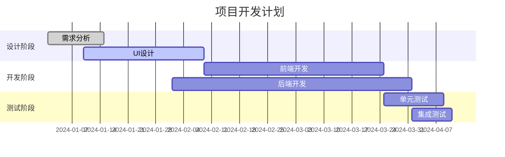
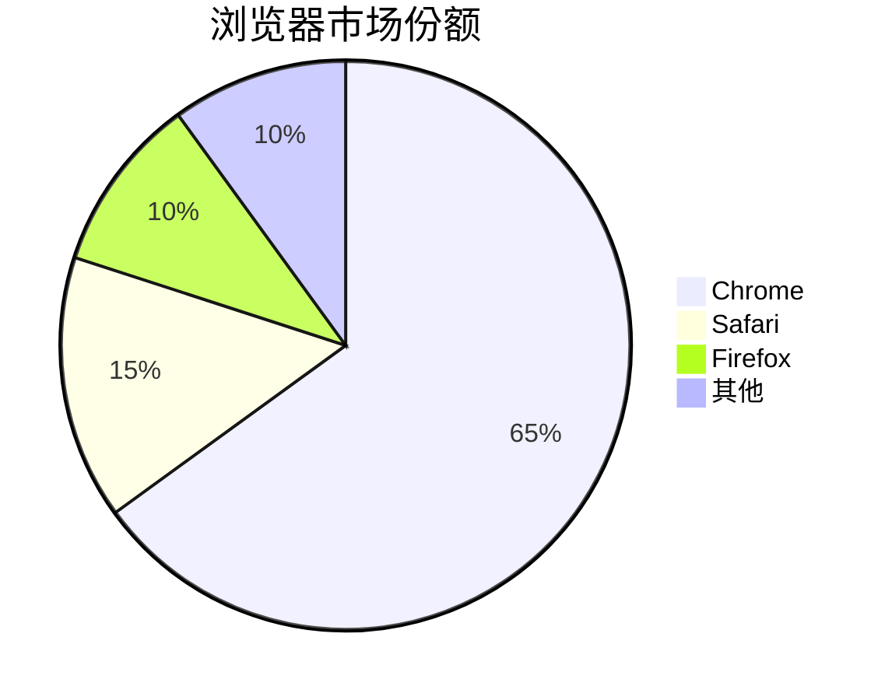
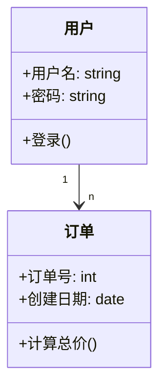

# markdown 特殊语法
## 图标类
### 流程图

```mermaid
graph TD
    A[开始] --> B{条件判断}
    B -->|Yes| C[执行操作A]
    B -->|No| D[执行操作B]
    C --> E[结束]
    D --> E
```

### 时序图

```mermaid
sequenceDiagram
    participant A as 用户
    participant B as 系统
    participant C as 数据库
    
    A->>B: 登录请求
    B->>C: 验证用户信息
    C-->>B: 返回验证结果
    B-->>A: 登录成功/失败
```
### 甘特图

```mermaid
gantt
    title 项目开发计划
    dateFormat  YYYY-MM-DD
    section 设计阶段
    需求分析      :done,    des1, 2024-01-01,2024-01-15
    UI设计       :active,  des2, 2024-01-10, 30d
    section 开发阶段
    前端开发      :         dev1, after des2, 45d
    后端开发      :         dev2, 2024-02-01, 60d
    section 测试阶段
    单元测试      :         test1, after dev1, 15d
    集成测试      :         test2, after dev2, 10d
```
### 饼图

```mermaid
pie
    title 浏览器市场份额
    "Chrome" : 65
    "Safari" : 15
    "Firefox" : 10
    "其他" : 10
```
### 类图

```mermaid
classDiagram
    class 用户 {
        +用户名: string
        +密码: string
        +登录()
    }
    
    class 订单 {
        +订单号: int
        +创建日期: date
        +计算总价()
    }
    
    用户 "1" --> "n" 订单
```

