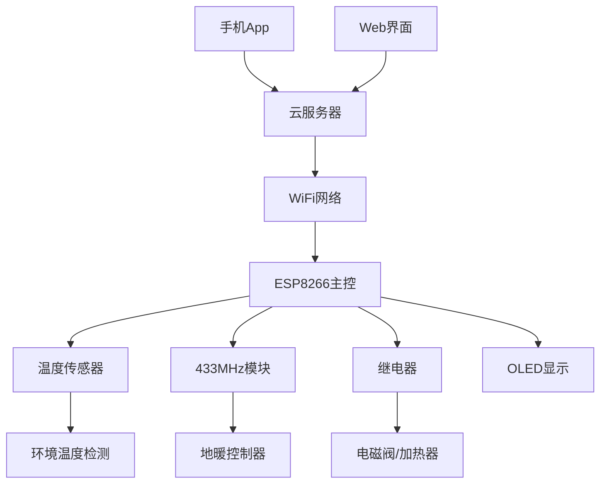
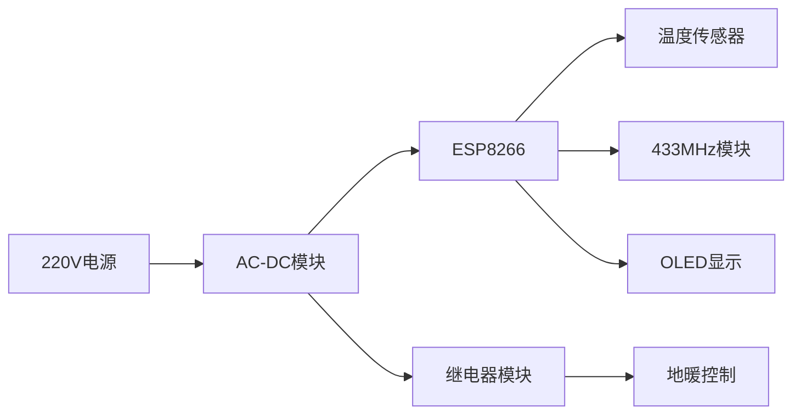

# 智能家居项目 - 地暖恒温控制系统

## 📋 项目概述

本项目旨在构建一个基于 ESP8266 的智能地暖恒温控制系统，支持远程控制、温度监测、定时调节等功能。系统可通过手机 App、Web 界面或语音助手进行控制。

### 🎯 主要功能
- 🌡️ 实时温度监测和显示
- 🔄 自动恒温控制
- 📱 手机 App 远程控制
- 🌐 Web 界面管理
- ⏰ 定时开关和温度调节
- 📊 历史数据记录和分析
- 🔔 异常报警通知
- 🎙️ 语音控制支持（可选）

## 🔧 硬件清单

### 核心控制器
- **ESP8266** （安信可 NodeMCU/Wemos D1 Mini）
  - WiFi 连接功能
  - GPIO 接口丰富
  - 支持 Arduino IDE 编程

### 通信模块
- **[433MHz 无线收发模块](https://detail.1688.com/offer/703849565767.html)**
  - 型号：MG100A
  - 用途：与现有地暖控制器通信
  - 频率：433MHz/315MHz 可选

### 电源模块
- **[AC-DC 开关电源模块](https://detail.1688.com/offer/730896565389.html)**
  - 输入：AC 220V
  - 输出：12V 300mA / 5V 700mA
  - 功率：3.5W
  - 特点：隔离安全，体积小巧

### 控制器件
- **继电器模块**
  - 规格：5V 单路/双路继电器
  - 用途：控制地暖阀门或加热器
  - 触点容量：10A 250VAC

### 传感器模块
- **温度传感器**
  - DS18B20 数字温度传感器（防水型）
  - DHT22 温湿度传感器
  - 精度：±0.5°C
  - 工作范围：-55°C ~ +125°C

### 显示模块（可选）
- **OLED 显示屏**
  - 型号：0.96寸 SSD1306
  - 分辨率：128x64
  - 用途：本地显示温度和状态

### 扩展硬件
- **蜂鸣器**：状态提示音
- **LED 指示灯**：工作状态显示
- **按键开关**：手动控制
- **外壳**：防护盒，推荐 IP65 防护等级

## 📐 系统架构



### 工作原理
1. **温度采集**：DS18B20 传感器实时监测室内温度
2. **数据处理**：ESP8266 处理温度数据并执行控制逻辑
3. **远程通信**：通过 WiFi 连接云服务器，支持远程控制
4. **本地控制**：433MHz 模块与地暖控制器通信
5. **执行控制**：继电器控制地暖系统开关

## 🔌 硬件连接图

### ESP8266 引脚分配
```
ESP8266 (NodeMCU)     连接设备
GPIO0  (D3)    -->    按键开关
GPIO2  (D4)    -->    继电器控制
GPIO4  (D2)    -->    DS18B20 数据线
GPIO5  (D1)    -->    OLED SCL
GPIO12 (D6)    -->    433MHz 发射模块
GPIO13 (D7)    -->    433MHz 接收模块
GPIO14 (D5)    -->    OLED SDA
GPIO16 (D0)    -->    LED 状态指示
3.3V           -->    传感器电源
GND            -->    公共地线
```

### 电源连接
```
220V AC 输入 --> AC-DC模块 --> 5V输出 --> ESP8266
                           --> 12V输出 --> 继电器模块
```

## 💻 软件架构

### 1. 固件开发 (Arduino IDE)

**主要库文件：**
```cpp
#include <ESP8266WiFi.h>          // WiFi 连接
#include <WiFiClient.h>           // WiFi 客户端
#include <ESP8266WebServer.h>     // Web 服务器
#include <OneWire.h>              // DS18B20 通信
#include <DallasTemperature.h>    // 温度传感器
#include <ArduinoJson.h>          // JSON 数据处理
#include <PubSubClient.h>         // MQTT 通信
#include <SSD1306Wire.h>          // OLED 显示
#include <RCSwitch.h>             // 433MHz 通信
```

**核心功能模块：**
```cpp
// 温度控制类
class TemperatureController {
private:
    float targetTemp;      // 目标温度
    float currentTemp;     // 当前温度
    float tolerance;       // 温度容差
    bool heatingStatus;    // 加热状态
    
public:
    void setTargetTemp(float temp);
    void updateCurrentTemp();
    void controlHeating();
    bool getHeatingStatus();
};

// WiFi 管理类
class WiFiManager {
private:
    String ssid;
    String password;
    
public:
    bool connect();
    void handleReconnect();
    String getStatus();
};

// 远程控制类
class RemoteControl {
private:
    WiFiClient wifiClient;
    PubSubClient mqttClient;
    String deviceId;
    unsigned long lastHeartbeat;
    bool mqttConnected;
    
public:
    RemoteControl(String id);
    void initMQTT();
    void handleCommands();
    void sendStatus();
    void sendHeartbeat();
    void reconnectMQTT();
    bool isConnected();
    void publishTemperature(float temp);
    void publishAlert(String alertType, String message);
};

// OLED显示管理类
class DisplayManager {
private:
    SSD1306Wire* display;
    bool displayEnabled;
    unsigned long lastUpdate;
    int currentPage;
    
public:
    DisplayManager(int sda, int scl);
    void init();
    void updateDisplay(float currentTemp, float targetTemp, bool heating, bool connected);
    void showWiFiConnecting();
    void showError(String error);
    void nextPage();
    void setBrightness(int level);
};

// 433MHz通信管理类
class RF433Manager {
private:
    RCSwitch transmitter;
    RCSwitch receiver;
    int txPin;
    int rxPin;
    unsigned long lastSignal;
    
public:
    RF433Manager(int tx, int rx);
    void init();
    void sendCommand(unsigned long code);
    bool receiveCommand(unsigned long& code);
    void sendHeatingOn();
    void sendHeatingOff();
    bool isSignalValid(unsigned long code);
};

// 安全监控类
class SecurityMonitor {
private:
    float maxTemp;
    float minTemp;
    unsigned long maxHeatingTime;
    unsigned long heatingStartTime;
    bool overheating;
    bool sensorError;
    
public:
    SecurityMonitor();
    void checkTemperatureLimits(float temp);
    void checkHeatingDuration(bool heating);
    void checkSensorHealth(float temp);
    bool hasAlerts();
    String getAlertMessage();
    void resetAlerts();
};

// 配置管理类
class ConfigManager {
private:
    float defaultTargetTemp;
    float tempTolerance;
    int updateInterval;
    String wifiSSID;
    String wifiPassword;
    String mqttServer;
    
public:
    ConfigManager();
    void loadFromEEPROM();
    void saveToEEPROM();
    void setWiFiCredentials(String ssid, String password);
    void setMQTTServer(String server);
    void setTemperatureSettings(float target, float tolerance);
    float getDefaultTargetTemp();
    float getTempTolerance();
    int getUpdateInterval();
};
```

### 2. Web 服务端 (Node.js)

**技术栈：**
- **后端框架**：Express.js
- **数据库**：MySQL / MongoDB
- **实时通信**：Socket.io / MQTT
- **前端框架**：Vue.js / React

**API 接口设计：**
```javascript
// 设备控制 API
app.post('/api/device/control', (req, res) => {
  // 设置目标温度
});

app.get('/api/device/status', (req, res) => {
  // 获取设备状态
});

app.get('/api/temperature/history', (req, res) => {
  // 获取历史温度数据
});

app.post('/api/schedule/set', (req, res) => {
  // 设置定时任务
});
```

### 3. 移动端 App

**开发选择：**
- **跨平台**：Flutter / React Native
- **原生开发**：Android Studio / Xcode
- **混合开发**：Ionic / Cordova

**主要页面：**
```
├── 首页
│   ├── 当前温度显示
│   ├── 目标温度设置
│   └── 加热状态指示
├── 控制页面
│   ├── 手动开关控制
│   ├── 模式选择
│   └── 温度调节
├── 定时页面
│   ├── 定时开关设置
│   ├── 温度计划
│   └── 星期重复设置
└── 历史数据
    ├── 温度曲线图
    ├── 能耗统计
    └── 数据导出
```

## ⚙️ 开发环境搭建

### 1. Arduino IDE 配置

```bash
# 安装 ESP8266 开发板支持包
# 在 Arduino IDE 中添加开发板管理器 URL：
# http://arduino.esp8266.com/stable/package_esp8266com_index.json

# 安装必要的库
# 工具 -> 管理库 -> 搜索并安装：
# - ESP8266WiFi
# - ArduinoJson
# - PubSubClient
# - OneWire
# - DallasTemperature
# - SSD1306
# - RCSwitch
```

### 2. Node.js 开发环境

```bash
# 创建项目目录
mkdir smart-home-server
cd smart-home-server

# 初始化项目
npm init -y

# 安装依赖
npm install express socket.io mysql2 mqtt dotenv
npm install -D nodemon

# 创建项目结构
mkdir src config public
touch src/app.js config/database.js .env
```

### 3. 前端开发环境

```bash
# Vue.js 项目
npm create vue@latest smart-home-web
cd smart-home-web
npm install

# 安装 UI 框架
npm install element-plus
npm install echarts  # 图表组件
```

## 📱 核心代码实现

### 1. ESP8266 主控代码

```cpp
#include <ESP8266WiFi.h>
#include <PubSubClient.h>
#include <OneWire.h>
#include <DallasTemperature.h>
#include <ArduinoJson.h>
#include <SSD1306Wire.h>
#include <RCSwitch.h>
#include <EEPROM.h>

// 硬件引脚定义
#define TEMP_SENSOR_PIN   4    // D2 - DS18B20
#define RELAY_PIN         2    // D4 - 继电器控制
#define LED_PIN          16    // D0 - LED指示灯
#define BUTTON_PIN        0    // D3 - 按键
#define OLED_SDA         14    // D5 - OLED数据线
#define OLED_SCL          5    // D1 - OLED时钟线
#define RF433_TX         12    // D6 - 433MHz发射
#define RF433_RX         13    // D7 - 433MHz接收
#define BUZZER_PIN       15    // D8 - 蜂鸣器

// 创建传感器实例
OneWire oneWire(TEMP_SENSOR_PIN);
DallasTemperature tempSensor(&oneWire);

// 创建功能模块实例
TemperatureController tempController;
WiFiManager wifiManager;
RemoteControl* remoteControl;
DisplayManager* displayManager;
RF433Manager* rf433Manager;
SecurityMonitor securityMonitor;
ConfigManager configManager;

// 全局变量
bool manualMode = false;
unsigned long lastStatusUpdate = 0;
unsigned long lastDisplayUpdate = 0;
unsigned long lastButtonPress = 0;
bool systemReady = false;

// 按键状态
volatile bool buttonPressed = false;
volatile unsigned long buttonPressTime = 0;

void setup() {
    Serial.begin(115200);
    Serial.println();
    Serial.println("🔥 智能地暖控制系统启动");
    Serial.println("=======================");
    
    // 初始化硬件引脚
    initializeHardware();
    
    // 加载配置
    configManager.loadFromEEPROM();
    configManager.printConfig();
    
    // 初始化传感器
    initializeSensors();
    
    // 初始化显示屏
    displayManager = new DisplayManager(OLED_SDA, OLED_SCL);
    displayManager->init();
    
    // 初始化WiFi
    initializeWiFi();
    
    // 初始化MQTT
    initializeMQTT();
    
    // 初始化433MHz模块
    rf433Manager = new RF433Manager(RF433_TX, RF433_RX);
    rf433Manager->init();
    
    // 设置初始温度
    tempController.setTargetTemp(configManager.getDefaultTargetTemp());
    
    // 系统就绪
    systemReady = true;
    playStartupSound();
    
    Serial.println("✅ 系统初始化完成");
    Serial.printf("🆔 设备ID: %s\n", configManager.getDeviceId().c_str());
    Serial.printf("🌡️ 目标温度: %.1f°C\n", tempController.getTargetTemp());
    
    // 显示就绪信息
    displayManager->updateDisplay(
        tempController.getCurrentTemp(),
        tempController.getTargetTemp(),
        tempController.getHeatingStatus(),
        wifiManager.isConnected()
    );
}

void loop() {
    if(!systemReady) return;
    
    // 处理WiFi连接
    wifiManager.handleReconnect();
    
    // 处理MQTT通信
    if(remoteControl) {
        remoteControl->handleCommands();
    }
    
    // 读取温度
    updateTemperature();
    
    // 温度控制逻辑
    handleTemperatureControl();
    
    // 处理按键
    handleButtonInput();
    
    // 处理433MHz通信
    handle433Communication();
    
    // 安全监控
    handleSecurityMonitoring();
    
    // 更新显示
    updateDisplay();
    
    // 发送状态数据
    sendStatusUpdate();
    
    // 小延时
    delay(100);
}

void initializeHardware() {
    // 配置引脚模式
    pinMode(RELAY_PIN, OUTPUT);
    pinMode(LED_PIN, OUTPUT);
    pinMode(BUTTON_PIN, INPUT_PULLUP);
    pinMode(BUZZER_PIN, OUTPUT);
    
    // 初始状态
    digitalWrite(RELAY_PIN, LOW);
    digitalWrite(LED_PIN, LOW);
    digitalWrite(BUZZER_PIN, LOW);
    
    // 配置按键中断
    attachInterrupt(digitalPinToInterrupt(BUTTON_PIN), buttonISR, FALLING);
    
    Serial.println("🔧 硬件初始化完成");
}

void initializeSensors() {
    tempSensor.begin();
    
    // 检查传感器数量
    int deviceCount = tempSensor.getDeviceCount();
    Serial.printf("🌡️ 发现 %d 个温度传感器\n", deviceCount);
    
    if(deviceCount == 0) {
        Serial.println("❌ 未发现温度传感器！");
        // 可以设置错误状态或使用模拟数据
    } else {
        tempSensor.setResolution(12);  // 设置12位精度
        Serial.println("✅ 温度传感器初始化完成");
    }
}

void initializeWiFi() {
    displayManager->showWiFiConnecting();
    
    String ssid = configManager.getWiFiSSID();
    String password = configManager.getWiFiPassword();
    
    if(ssid.length() == 0) {
        // 没有WiFi配置，启动AP模式
        wifiManager.startAPMode();
        setupWebConfig();  // 启动Web配置页面
    } else {
        wifiManager.setCredentials(ssid, password);
        bool connected = wifiManager.connect();
        
        if(connected) {
            digitalWrite(LED_PIN, HIGH);  // WiFi连接成功指示
        }
    }
}

void initializeMQTT() {
    if(!wifiManager.isConnected()) return;
    
    remoteControl = new RemoteControl(configManager.getDeviceId());
    remoteControl->setServer(configManager.getMQTTServer(), configManager.getMQTTPort());
    remoteControl->initMQTT();
    remoteControl->connect();
}

void updateTemperature() {
    static unsigned long lastTempRead = 0;
    unsigned long now = millis();
    
    if(now - lastTempRead > 5000) {  // 5秒读取一次温度
        lastTempRead = now;
        
        tempSensor.requestTemperatures();
        float temp = tempSensor.getTempCByIndex(0);
        
        if(temp != DEVICE_DISCONNECTED_C && temp > -50 && temp < 80) {
            tempController.updateCurrentTemp(temp);
            securityMonitor.checkTemperatureLimits(temp);
            securityMonitor.checkSensorHealth(temp);
        } else {
            Serial.println("❌ 温度传感器读取失败");
            securityMonitor.checkSensorHealth(-127.0);  // 传递错误值
        }
    }
}

void handleTemperatureControl() {
    if(!manualMode) {
        // 自动模式
        bool statusChanged = tempController.controlHeating();
        
        if(statusChanged) {
            bool heating = tempController.getHeatingStatus();
            
            // 控制继电器
            digitalWrite(RELAY_PIN, heating ? HIGH : LOW);
            
            // 控制433MHz设备（如果需要）
            if(heating) {
                rf433Manager->sendHeatingOn();
            } else {
                rf433Manager->sendHeatingOff();
            }
            
            // 播放提示音
            if(heating) {
                playBeep(2, 100);  // 开启加热：2声短鸣
            } else {
                playBeep(1, 200);  // 关闭加热：1声长鸣
            }
        }
    }
    
    // 更新安全监控
    securityMonitor.checkHeatingDuration(tempController.getHeatingStatus());
}

void handleButtonInput() {
    if(buttonPressed) {
        buttonPressed = false;
        unsigned long pressDuration = millis() - buttonPressTime;
        
        if(pressDuration > 50 && pressDuration < 3000) {
            // 短按：切换页面
            displayManager->nextPage();
            playBeep(1, 50);
        } else if(pressDuration >= 3000) {
            // 长按：切换手动/自动模式
            manualMode = !manualMode;
            Serial.printf("🔧 切换到%s模式\n", manualMode ? "手动" : "自动");
            
            if(manualMode) {
                playBeep(3, 100);  // 手动模式：3声短鸣
            } else {
                playBeep(2, 200);  // 自动模式：2声长鸣
            }
        }
    }
}

void handle433Communication() {
    unsigned long receivedCode;
    if(rf433Manager->receiveCommand(receivedCode)) {
        // 处理接收到的433MHz信号
        Serial.printf("📡 收到433MHz信号: %lu\n", receivedCode);
        
        // 可以根据信号码执行相应操作
        // 例如：温度调节、模式切换等
    }
}

void handleSecurityMonitoring() {
    static unsigned long lastSecurityCheck = 0;
    unsigned long now = millis();
    
    if(now - lastSecurityCheck > 10000) {  // 10秒检查一次
        lastSecurityCheck = now;
        
        if(securityMonitor.hasAlerts()) {
            String alertMsg = securityMonitor.getDetailedAlert();
            Serial.printf("🚨 安全警报: %s\n", alertMsg.c_str());
            
            // 发送MQTT警报
            if(remoteControl && remoteControl->isConnected()) {
                String alertType = securityMonitor.isOverheating() ? "overheat" :
                                 securityMonitor.isSensorError() ? "sensor_error" :
                                 securityMonitor.isHeatingTimeout() ? "heating_timeout" : "unknown";
                
                remoteControl->publishAlert(alertType, alertMsg);
            }
            
            // 显示错误信息
            displayManager->showError(securityMonitor.getAlertMessage());
            
            // 播放警报声
            playAlarm();
            
            // 如果过热，立即关闭加热
            if(securityMonitor.isOverheating()) {
                digitalWrite(RELAY_PIN, LOW);
                tempController.setHeatingStatus(false);
                manualMode = true;  // 切换到手动模式防止自动重启
            }
        }
    }
}

void updateDisplay() {
    static unsigned long lastDisplayUpdate = 0;
    unsigned long now = millis();
    
    if(now - lastDisplayUpdate > 1000) {  // 1秒更新一次显示
        lastDisplayUpdate = now;
        
        if(!securityMonitor.hasAlerts()) {  // 没有警报时正常显示
            displayManager->updateDisplay(
                tempController.getCurrentTemp(),
                tempController.getTargetTemp(),
                tempController.getHeatingStatus(),
                wifiManager.isConnected()
            );
        }
    }
}

void sendStatusUpdate() {
    static unsigned long lastStatusSend = 0;
    unsigned long now = millis();
    
    int updateInterval = configManager.getUpdateInterval() * 1000;
    if(now - lastStatusSend > updateInterval) {
        lastStatusSend = now;
        
        if(remoteControl && remoteControl->isConnected()) {
            remoteControl->sendStatus(
                tempController.getCurrentTemp(),
                tempController.getTargetTemp(),
                tempController.getHeatingStatus(),
                manualMode
            );
        }
    }
}

// 中断服务程序
ICACHE_RAM_ATTR void buttonISR() {
    static unsigned long lastInterrupt = 0;
    unsigned long now = millis();
    
    // 防抖动
    if(now - lastInterrupt > 200) {
        buttonPressed = true;
        buttonPressTime = now;
        lastInterrupt = now;
    }
}

// 声音提示函数
void playBeep(int count, int duration) {
    for(int i = 0; i < count; i++) {
        digitalWrite(BUZZER_PIN, HIGH);
        delay(duration);
        digitalWrite(BUZZER_PIN, LOW);
        if(i < count - 1) delay(100);
    }
}

void playStartupSound() {
    // 播放启动音效
    int melody[] = {262, 294, 330, 349};  // C, D, E, F
    for(int i = 0; i < 4; i++) {
        tone(BUZZER_PIN, melody[i], 200);
        delay(250);
    }
    noTone(BUZZER_PIN);
}

void playAlarm() {
    // 播放警报声
    for(int i = 0; i < 5; i++) {
        digitalWrite(BUZZER_PIN, HIGH);
        delay(100);
        digitalWrite(BUZZER_PIN, LOW);
        delay(100);
    }
}

// Web配置页面（当没有WiFi配置时使用）
void setupWebConfig() {
    // 这里可以添加Web服务器代码来配置WiFi
    // 详细实现可以使用WiFiManager库或自定义Web界面
    Serial.println("🌐 启动Web配置服务器");
    Serial.println("请连接到 SmartHeater_Config 网络进行配置");
}

// 命令处理回调（供MQTT使用）
void handleRemoteCommand(String command, JsonDocument& params) {
    if(command == "setTargetTemp") {
        float newTarget = params["value"];
        tempController.setTargetTemp(newTarget);
        Serial.printf("🎯 远程设置目标温度: %.1f°C\n", newTarget);
        
    } else if(command == "setMode") {
        manualMode = params["manual"];
        Serial.printf("🔧 远程切换模式: %s\n", manualMode ? "手动" : "自动");
        
    } else if(command == "manualControl") {
        if(manualMode) {
            bool heating = params["heating"];
            digitalWrite(RELAY_PIN, heating ? HIGH : LOW);
            tempController.setHeatingStatus(heating);
            Serial.printf("🔥 远程手动控制: %s\n", heating ? "开启" : "关闭");
        }
        
    } else if(command == "updateConfig") {
        // 更新配置
        if(params.containsKey("targetTemp")) {
            configManager.setTemperatureSettings(params["targetTemp"], configManager.getTempTolerance());
        }
        if(params.containsKey("updateInterval")) {
            configManager.setUpdateInterval(params["updateInterval"]);
        }
        configManager.saveToEEPROM();
        Serial.println("💾 配置已更新");
        
    } else if(command == "resetAlerts") {
        securityMonitor.resetAlerts();
        Serial.println("🔄 警报已重置");
        
    } else if(command == "reboot") {
        Serial.println("🔄 远程重启");
        delay(1000);
        ESP.restart();
    }
}

// 系统状态检查
void checkSystemHealth() {
    // 检查堆内存
    if(ESP.getFreeHeap() < 1000) {
        Serial.println("⚠️ 内存不足警告");
    }
    
    // 检查WiFi连接
    if(!wifiManager.isConnected()) {
        digitalWrite(LED_PIN, LOW);
    }
    
    // 检查MQTT连接
    if(remoteControl && !remoteControl->isConnected()) {
        Serial.println("⚠️ MQTT连接丢失");
    }
}
```

### 2. Node.js 服务器代码

```javascript
// src/app.js
const express = require('express');
const http = require('http');
const socketIo = require('socket.io');
const mqtt = require('mqtt');
const mysql = require('mysql2/promise');
require('dotenv').config();

const app = express();
const server = http.createServer(app);
const io = socketIo(server, {
  cors: {
    origin: "*",
    methods: ["GET", "POST"]
  }
});

// 中间件
app.use(express.json());
app.use(express.static('public'));

// 数据库连接
const dbConfig = {
  host: process.env.DB_HOST || 'localhost',
  user: process.env.DB_USER || 'root',
  password: process.env.DB_PASSWORD || '',
  database: process.env.DB_NAME || 'smart_home'
};

// MQTT 客户端
const mqttClient = mqtt.connect(process.env.MQTT_BROKER || 'mqtt://localhost:1883');

// 全局状态
let deviceStatus = {
  currentTemp: 0,
  targetTemp: 22,
  heatingStatus: false,
  manualMode: false,
  lastUpdate: new Date()
};

// MQTT 事件处理
mqttClient.on('connect', () => {
  console.log('MQTT 连接成功');
  mqttClient.subscribe('smart-home/temperature/status');
});

mqttClient.on('message', async (topic, message) => {
  try {
    const data = JSON.parse(message.toString());
    
    if (topic === 'smart-home/temperature/status') {
      deviceStatus = {
        ...data,
        lastUpdate: new Date()
      };
      
      // 广播状态给所有连接的客户端
      io.emit('deviceStatus', deviceStatus);
      
      // 保存到数据库
      await saveTemperatureData(data);
    }
  } catch (error) {
    console.error('MQTT 消息处理错误:', error);
  }
});

// Socket.io 连接处理
io.on('connection', (socket) => {
  console.log('客户端连接:', socket.id);
  
  // 发送当前状态
  socket.emit('deviceStatus', deviceStatus);
  
  // 处理温度设置
  socket.on('setTargetTemp', (targetTemp) => {
    const command = { targetTemp: parseFloat(targetTemp) };
    mqttClient.publish('smart-home/temperature/control', JSON.stringify(command));
    console.log('设置目标温度:', targetTemp);
  });
  
  // 处理模式切换
  socket.on('setMode', (manualMode) => {
    const command = { manualMode: Boolean(manualMode) };
    mqttClient.publish('smart-home/temperature/control', JSON.stringify(command));
    console.log('设置模式:', manualMode ? '手动' : '自动');
  });
  
  // 处理手动控制
  socket.on('manualControl', (heating) => {
    const command = { heating: Boolean(heating), manualMode: true };
    mqttClient.publish('smart-home/temperature/control', JSON.stringify(command));
    console.log('手动控制加热:', heating ? '开启' : '关闭');
  });
  
  socket.on('disconnect', () => {
    console.log('客户端断开:', socket.id);
  });
});

// REST API 路由
app.get('/api/status', (req, res) => {
  res.json(deviceStatus);
});

app.post('/api/control', (req, res) => {
  const { targetTemp, manualMode, heating } = req.body;
  
  const command = {};
  if (targetTemp !== undefined) command.targetTemp = parseFloat(targetTemp);
  if (manualMode !== undefined) command.manualMode = Boolean(manualMode);
  if (heating !== undefined) command.heating = Boolean(heating);
  
  mqttClient.publish('smart-home/temperature/control', JSON.stringify(command));
  
  res.json({ success: true, message: '命令已发送' });
});

app.get('/api/history', async (req, res) => {
  try {
    const { startDate, endDate, limit = 100 } = req.query;
    
    const connection = await mysql.createConnection(dbConfig);
    
    let query = 'SELECT * FROM temperature_logs';
    let params = [];
    
    if (startDate && endDate) {
      query += ' WHERE timestamp BETWEEN ? AND ?';
      params = [startDate, endDate];
    }
    
    query += ' ORDER BY timestamp DESC LIMIT ?';
    params.push(parseInt(limit));
    
    const [rows] = await connection.execute(query, params);
    await connection.end();
    
    res.json(rows);
  } catch (error) {
    console.error('查询历史数据错误:', error);
    res.status(500).json({ error: '查询失败' });
  }
});

// 定时任务相关 API
app.get('/api/schedules', async (req, res) => {
  try {
    const connection = await mysql.createConnection(dbConfig);
    const [rows] = await connection.execute('SELECT * FROM schedules WHERE enabled = 1');
    await connection.end();
    res.json(rows);
  } catch (error) {
    res.status(500).json({ error: '查询定时任务失败' });
  }
});

app.post('/api/schedules', async (req, res) => {
  try {
    const { name, time, targetTemp, weekdays, enabled = true } = req.body;
    
    const connection = await mysql.createConnection(dbConfig);
    const [result] = await connection.execute(
      'INSERT INTO schedules (name, time, target_temp, weekdays, enabled) VALUES (?, ?, ?, ?, ?)',
      [name, time, targetTemp, JSON.stringify(weekdays), enabled]
    );
    await connection.end();
    
    res.json({ success: true, id: result.insertId });
  } catch (error) {
    res.status(500).json({ error: '创建定时任务失败' });
  }
});

// 数据库操作函数
async function saveTemperatureData(data) {
  try {
    const connection = await mysql.createConnection(dbConfig);
    await connection.execute(
      'INSERT INTO temperature_logs (current_temp, target_temp, heating_status, timestamp) VALUES (?, ?, ?, NOW())',
      [data.currentTemp, data.targetTemp, data.heatingStatus]
    );
    await connection.end();
  } catch (error) {
    console.error('保存温度数据错误:', error);
  }
}

// 定时任务处理
function checkSchedules() {
  // 检查并执行定时任务的逻辑
  // 这里可以添加 cron 任务来定期检查
}

const PORT = process.env.PORT || 3000;
server.listen(PORT, () => {
  console.log(`智能家居服务器运行在端口 ${PORT}`);
});
```

### 3. 数据库结构

```sql
-- 创建数据库
CREATE DATABASE smart_home CHARACTER SET utf8mb4 COLLATE utf8mb4_unicode_ci;
USE smart_home;

-- 温度日志表
CREATE TABLE temperature_logs (
    id INT AUTO_INCREMENT PRIMARY KEY,
    current_temp DECIMAL(5,2) NOT NULL COMMENT '当前温度',
    target_temp DECIMAL(5,2) NOT NULL COMMENT '目标温度',
    heating_status BOOLEAN NOT NULL DEFAULT FALSE COMMENT '加热状态',
    timestamp DATETIME DEFAULT CURRENT_TIMESTAMP COMMENT '记录时间',
    INDEX idx_timestamp (timestamp)
) COMMENT='温度监控日志';

-- 定时任务表
CREATE TABLE schedules (
    id INT AUTO_INCREMENT PRIMARY KEY,
    name VARCHAR(100) NOT NULL COMMENT '任务名称',
    time TIME NOT NULL COMMENT '执行时间',
    target_temp DECIMAL(5,2) NOT NULL COMMENT '目标温度',
    weekdays JSON NOT NULL COMMENT '执行星期',
    enabled BOOLEAN DEFAULT TRUE COMMENT '是否启用',
    created_at DATETIME DEFAULT CURRENT_TIMESTAMP,
    updated_at DATETIME DEFAULT CURRENT_TIMESTAMP ON UPDATE CURRENT_TIMESTAMP
) COMMENT='定时任务';

-- 设备配置表
CREATE TABLE device_config (
    id INT AUTO_INCREMENT PRIMARY KEY,
    config_key VARCHAR(50) NOT NULL UNIQUE,
    config_value TEXT NOT NULL,
    description VARCHAR(200),
    updated_at DATETIME DEFAULT CURRENT_TIMESTAMP ON UPDATE CURRENT_TIMESTAMP
) COMMENT='设备配置';

-- 插入默认配置
INSERT INTO device_config (config_key, config_value, description) VALUES 
('default_target_temp', '22.0', '默认目标温度'),
('temp_tolerance', '0.5', '温度控制容差'),
('heating_max_duration', '120', '最大连续加热时间(分钟)'),
('temp_update_interval', '30', '温度更新间隔(秒)');

-- 报警日志表
CREATE TABLE alarm_logs (
    id INT AUTO_INCREMENT PRIMARY KEY,
    alarm_type ENUM('high_temp', 'low_temp', 'sensor_error', 'connection_lost') NOT NULL,
    message TEXT NOT NULL,
    current_temp DECIMAL(5,2),
    resolved BOOLEAN DEFAULT FALSE,
    created_at DATETIME DEFAULT CURRENT_TIMESTAMP,
    resolved_at DATETIME NULL
) COMMENT='报警日志';
```

### 4. 完整的类实现

```cpp
// ========================= TemperatureController 实现 =========================
class TemperatureController {
private:
    float targetTemp;
    float currentTemp;
    float tolerance;
    bool heatingStatus;
    unsigned long lastTempRead;
    float tempHistory[10];  // 温度历史记录
    int historyIndex;
    
public:
    TemperatureController() {
        targetTemp = 22.0;
        currentTemp = 0.0;
        tolerance = 0.5;
        heatingStatus = false;
        lastTempRead = 0;
        historyIndex = 0;
        
        // 初始化温度历史
        for(int i = 0; i < 10; i++) {
            tempHistory[i] = 0.0;
        }
    }
    
    void setTargetTemp(float temp) {
        if(temp >= 5.0 && temp <= 35.0) {
            targetTemp = temp;
            Serial.printf("目标温度设置为: %.1f°C\n", targetTemp);
        }
    }
    
    float getTargetTemp() {
        return targetTemp;
    }
    
    void updateCurrentTemp(float temp) {
        if(temp > -50.0 && temp < 80.0) {  // 合理温度范围检查
            currentTemp = temp;
            
            // 更新温度历史
            tempHistory[historyIndex] = temp;
            historyIndex = (historyIndex + 1) % 10;
            
            lastTempRead = millis();
        }
    }
    
    float getCurrentTemp() {
        return currentTemp;
    }
    
    bool controlHeating() {
        bool shouldHeat = currentTemp < (targetTemp - tolerance);
        bool shouldStop = currentTemp > (targetTemp + tolerance);
        
        if(shouldHeat && !heatingStatus) {
            heatingStatus = true;
            Serial.println("🔥 开启加热");
            return true;  // 状态改变
        } else if(shouldStop && heatingStatus) {
            heatingStatus = false;
            Serial.println("❄️ 关闭加热");
            return true;  // 状态改变
        }
        
        return false;  // 状态未改变
    }
    
    bool getHeatingStatus() {
        return heatingStatus;
    }
    
    void setHeatingStatus(bool status) {
        heatingStatus = status;
    }
    
    float getAverageTemp() {
        float sum = 0;
        int count = 0;
        for(int i = 0; i < 10; i++) {
            if(tempHistory[i] != 0.0) {
                sum += tempHistory[i];
                count++;
            }
        }
        return count > 0 ? sum / count : currentTemp;
    }
    
    bool isTempStable() {
        // 检查温度是否稳定（变化小于0.2度）
        float max = tempHistory[0];
        float min = tempHistory[0];
        
        for(int i = 1; i < 10; i++) {
            if(tempHistory[i] != 0.0) {
                if(tempHistory[i] > max) max = tempHistory[i];
                if(tempHistory[i] < min) min = tempHistory[i];
            }
        }
        
        return (max - min) < 0.2;
    }
};

// ========================= WiFiManager 实现 =========================
class WiFiManager {
private:
    String ssid;
    String password;
    unsigned long lastReconnectAttempt;
    int reconnectInterval;
    bool apMode;
    
public:
    WiFiManager() {
        lastReconnectAttempt = 0;
        reconnectInterval = 30000;  // 30秒重连间隔
        apMode = false;
    }
    
    void setCredentials(String s, String p) {
        ssid = s;
        password = p;
    }
    
    bool connect() {
        WiFi.mode(WIFI_STA);
        WiFi.begin(ssid.c_str(), password.c_str());
        
        Serial.printf("正在连接到 WiFi: %s", ssid.c_str());
        
        int attempts = 0;
        while(WiFi.status() != WL_CONNECTED && attempts < 20) {
            delay(500);
            Serial.print(".");
            attempts++;
        }
        
        if(WiFi.status() == WL_CONNECTED) {
            Serial.println();
            Serial.print("WiFi 连接成功！IP 地址: ");
            Serial.println(WiFi.localIP());
            
            // WiFi 连接成功指示
            digitalWrite(LED_PIN, HIGH);
            apMode = false;
            return true;
        } else {
            Serial.println();
            Serial.println("❌ WiFi连接失败，启动AP模式");
            startAPMode();
            return false;
        }
    }
    
    void startAPMode() {
        WiFi.mode(WIFI_AP);
        WiFi.softAP("SmartHeater_Config", "12345678");
        
        Serial.printf("🔥 AP模式已启动\n");
        Serial.printf("📡 AP IP: %s\n", WiFi.softAPIP().toString().c_str());
        Serial.println("🌐 请连接到 'SmartHeater_Config' 进行配置");
        
        apMode = true;
    }
    
    void handleReconnect() {
        if(WiFi.status() != WL_CONNECTED && !apMode) {
            unsigned long now = millis();
            if(now - lastReconnectAttempt > reconnectInterval) {
                lastReconnectAttempt = now;
                Serial.println("🔄 尝试重新连接WiFi...");
                
                if(!connect()) {
                    reconnectInterval = min(reconnectInterval * 2, 300000);  // 最大5分钟
                } else {
                    reconnectInterval = 30000;  // 重置为30秒
                }
            }
        }
    }
    
    String getStatus() {
        if(apMode) {
            return "AP模式";
        } else if(WiFi.status() == WL_CONNECTED) {
            return "已连接 - " + WiFi.localIP().toString();
        } else {
            return "未连接";
        }
    }
    
    int getSignalStrength() {
        return WiFi.RSSI();
    }
    
    bool isConnected() {
        return WiFi.status() == WL_CONNECTED && !apMode;
    }
    
    bool isAPMode() {
        return apMode;
    }
};

// ========================= RemoteControl 实现 =========================
class RemoteControl {
private:
    WiFiClient wifiClient;
    PubSubClient mqttClient;
    String deviceId;
    String mqttServer;
    int mqttPort;
    unsigned long lastHeartbeat;
    unsigned long lastReconnectAttempt;
    bool mqttConnected;
    
public:
    RemoteControl(String id) : mqttClient(wifiClient) {
        deviceId = id;
        mqttServer = "your-mqtt-server.com";
        mqttPort = 1883;
        lastHeartbeat = 0;
        lastReconnectAttempt = 0;
        mqttConnected = false;
    }
    
    void initMQTT() {
        mqttClient.setServer(mqttServer.c_str(), mqttPort);
        mqttClient.setCallback([this](char* topic, byte* payload, unsigned int length) {
            this->onMqttMessage(topic, payload, length);
        });
        
        mqttClient.setKeepAlive(60);
        mqttClient.setSocketTimeout(30);
        
        Serial.println("📡 MQTT客户端已初始化");
    }
    
    void setServer(String server, int port) {
        mqttServer = server;
        mqttPort = port;
        mqttClient.setServer(server.c_str(), port);
    }
    
    bool connect() {
        if(!WiFi.isConnected()) {
            return false;
        }
        
        String clientId = "SmartHeater_" + deviceId + "_" + String(random(0xffff), HEX);
        
        Serial.printf("🔌 尝试连接MQTT: %s:%d\n", mqttServer.c_str(), mqttPort);
        
        if(mqttClient.connect(clientId.c_str())) {
            mqttConnected = true;
            Serial.println("✅ MQTT连接成功");
            
            // 订阅控制主题
            String controlTopic = "smart-home/" + deviceId + "/control";
            mqttClient.subscribe(controlTopic.c_str());
            Serial.printf("📨 已订阅: %s\n", controlTopic.c_str());
            
            // 发送上线消息
            publishOnlineStatus(true);
            
            return true;
        } else {
            mqttConnected = false;
            Serial.printf("❌ MQTT连接失败, 错误码: %d\n", mqttClient.state());
            return false;
        }
    }
    
    void handleCommands() {
        if(mqttConnected) {
            mqttClient.loop();
        } else {
            reconnectMQTT();
        }
        
        // 发送心跳
        sendHeartbeat();
    }
    
    void reconnectMQTT() {
        unsigned long now = millis();
        if(now - lastReconnectAttempt > 5000) {  // 5秒重连间隔
            lastReconnectAttempt = now;
            connect();
        }
    }
    
    void sendStatus(float currentTemp, float targetTemp, bool heating, bool manual) {
        if(!mqttConnected) return;
        
        DynamicJsonDocument doc(512);
        doc["deviceId"] = deviceId;
        doc["currentTemp"] = round(currentTemp * 10) / 10.0;  // 保留1位小数
        doc["targetTemp"] = round(targetTemp * 10) / 10.0;
        doc["heatingStatus"] = heating;
        doc["manualMode"] = manual;
        doc["timestamp"] = millis();
        doc["rssi"] = WiFi.RSSI();
        doc["freeHeap"] = ESP.getFreeHeap();
        
        String output;
        serializeJson(doc, output);
        
        String topic = "smart-home/" + deviceId + "/status";
        mqttClient.publish(topic.c_str(), output.c_str(), true);  // 保留消息
    }
    
    void sendHeartbeat() {
        unsigned long now = millis();
        if(now - lastHeartbeat > 30000) {  // 30秒心跳
            lastHeartbeat = now;
            
            if(mqttConnected) {
                DynamicJsonDocument doc(256);
                doc["deviceId"] = deviceId;
                doc["timestamp"] = now;
                doc["uptime"] = now;
                doc["rssi"] = WiFi.RSSI();
                doc["freeHeap"] = ESP.getFreeHeap();
                
                String output;
                serializeJson(doc, output);
                
                String topic = "smart-home/" + deviceId + "/heartbeat";
                mqttClient.publish(topic.c_str(), output.c_str());
            }
        }
    }
    
    void publishAlert(String alertType, String message) {
        if(!mqttConnected) return;
        
        DynamicJsonDocument doc(512);
        doc["deviceId"] = deviceId;
        doc["alertType"] = alertType;
        doc["message"] = message;
        doc["timestamp"] = millis();
        doc["severity"] = getSeverityLevel(alertType);
        
        String output;
        serializeJson(doc, output);
        
        String topic = "smart-home/" + deviceId + "/alert";
        mqttClient.publish(topic.c_str(), output.c_str());
        
        Serial.printf("🚨 发送报警: %s - %s\n", alertType.c_str(), message.c_str());
    }
    
    void publishOnlineStatus(bool online) {
        if(!mqttConnected) return;
        
        String topic = "smart-home/" + deviceId + "/online";
        mqttClient.publish(topic.c_str(), online ? "true" : "false", true);
    }
    
    bool isConnected() {
        return mqttConnected && mqttClient.connected();
    }
    
private:
    void onMqttMessage(char* topic, byte* payload, unsigned int length) {
        String message;
        for(unsigned int i = 0; i < length; i++) {
            message += (char)payload[i];
        }
        
        Serial.printf("📨 收到MQTT消息: %s = %s\n", topic, message.c_str());
        
        // 解析JSON命令
        DynamicJsonDocument doc(1024);
        DeserializationError error = deserializeJson(doc, message);
        
        if(error) {
            Serial.printf("❌ JSON解析错误: %s\n", error.c_str());
            return;
        }
        
        // 处理不同的命令
        handleRemoteCommand(doc);
    }
    
    void handleRemoteCommand(JsonDocument& doc) {
        // 这里需要外部处理器来实际执行命令
        // 可以通过回调函数或全局变量来实现
        
        if(doc.containsKey("targetTemp")) {
            float newTarget = doc["targetTemp"];
            // 通知主程序更新目标温度
            Serial.printf("🎯 远程设置目标温度: %.1f°C\n", newTarget);
        }
        
        if(doc.containsKey("manualMode")) {
            bool manual = doc["manualMode"];
            Serial.printf("🔧 远程切换模式: %s\n", manual ? "手动" : "自动");
        }
        
        if(doc.containsKey("heating") && doc.containsKey("manualMode") && doc["manualMode"]) {
            bool heating = doc["heating"];
            Serial.printf("🔥 远程手动控制: %s\n", heating ? "开启加热" : "关闭加热");
        }
        
        if(doc.containsKey("reboot") && doc["reboot"]) {
            Serial.println("🔄 远程重启命令");
            delay(1000);
            ESP.restart();
        }
    }
    
    String getSeverityLevel(String alertType) {
        if(alertType == "overheat" || alertType == "sensor_error") {
            return "high";
        } else if(alertType == "connection_lost" || alertType == "heating_timeout") {
            return "medium";
        } else {
            return "low";
        }
    }
};

// ========================= DisplayManager 实现 =========================
class DisplayManager {
private:
    SSD1306Wire* display;
    bool displayEnabled;
    unsigned long lastUpdate;
    int currentPage;
    bool displayOn;
    
public:
    DisplayManager(int sda, int scl) {
        display = new SSD1306Wire(0x3c, sda, scl);
        displayEnabled = false;
        lastUpdate = 0;
        currentPage = 0;
        displayOn = true;
    }
    
    void init() {
        display->init();
        display->flipScreenVertically();
        display->setFont(ArialMT_Plain_10);
        
        // 显示启动画面
        display->clear();
        display->setTextAlignment(TEXT_ALIGN_CENTER);
        display->setFont(ArialMT_Plain_16);
        display->drawString(64, 20, "智能地暖");
        display->setFont(ArialMT_Plain_10);
        display->drawString(64, 40, "系统启动中...");
        display->display();
        
        displayEnabled = true;
        Serial.println("📺 OLED显示屏已初始化");
    }
    
    void updateDisplay(float currentTemp, float targetTemp, bool heating, bool connected) {
        if(!displayEnabled || !displayOn) return;
        
        unsigned long now = millis();
        if(now - lastUpdate < 1000) return;  // 1秒更新一次
        lastUpdate = now;
        
        display->clear();
        
        switch(currentPage) {
            case 0:
                drawMainPage(currentTemp, targetTemp, heating, connected);
                break;
            case 1:
                drawStatusPage(connected);
                break;
            case 2:
                drawSystemPage();
                break;
        }
        
        display->display();
    }
    
    void drawMainPage(float currentTemp, float targetTemp, bool heating, bool connected) {
        // 连接状态图标
        if(connected) {
            display->setPixel(120, 2);
            display->setPixel(121, 1);
            display->setPixel(122, 0);
            display->setPixel(123, 1);
            display->setPixel(124, 2);
        } else {
            display->drawString(110, 0, "❌");
        }
        
        // 当前温度 (大字体)
        display->setFont(ArialMT_Plain_24);
        display->setTextAlignment(TEXT_ALIGN_CENTER);
        String tempStr = String(currentTemp, 1) + "°C";
        display->drawString(64, 15, tempStr);
        
        // 目标温度
        display->setFont(ArialMT_Plain_10);
        display->setTextAlignment(TEXT_ALIGN_LEFT);
        display->drawString(0, 45, "目标: " + String(targetTemp, 1) + "°C");
        
        // 加热状态
        display->setTextAlignment(TEXT_ALIGN_RIGHT);
        if(heating) {
            display->drawString(128, 45, "🔥 加热中");
        } else {
            display->drawString(128, 45, "❄️ 待机");
        }
        
        // 页面指示器
        drawPageIndicator();
    }
    
    void drawStatusPage(bool connected) {
        display->setFont(ArialMT_Plain_10);
        display->setTextAlignment(TEXT_ALIGN_LEFT);
        
        display->drawString(0, 0, "系统状态");
        display->drawString(0, 15, "WiFi: " + (connected ? "已连接" : "未连接"));
        display->drawString(0, 25, "RSSI: " + String(WiFi.RSSI()) + " dBm");
        display->drawString(0, 35, "内存: " + String(ESP.getFreeHeap()) + " B");
        display->drawString(0, 45, "运行: " + String(millis() / 1000) + " 秒");
        
        drawPageIndicator();
    }
    
    void drawSystemPage() {
        display->setFont(ArialMT_Plain_10);
        display->setTextAlignment(TEXT_ALIGN_LEFT);
        
        display->drawString(0, 0, "设备信息");
        display->drawString(0, 15, "芯片: ESP8266");
        display->drawString(0, 25, "频率: " + String(ESP.getCpuFreqMHz()) + " MHz");
        display->drawString(0, 35, "Flash: " + String(ESP.getFlashChipSize()) + " B");
        display->drawString(0, 45, "版本: v1.0.0");
        
        drawPageIndicator();
    }
    
    void drawPageIndicator() {
        // 在底部绘制页面指示器
        int totalPages = 3;
        int indicatorWidth = 6;
        int spacing = 2;
        int startX = 64 - (totalPages * indicatorWidth + (totalPages - 1) * spacing) / 2;
        
        for(int i = 0; i < totalPages; i++) {
            int x = startX + i * (indicatorWidth + spacing);
            if(i == currentPage) {
                display->fillRect(x, 58, indicatorWidth, 4);
            } else {
                display->drawRect(x, 58, indicatorWidth, 4);
            }
        }
    }
    
    void nextPage() {
        currentPage = (currentPage + 1) % 3;
    }
    
    void showWiFiConnecting() {
        if(!displayEnabled) return;
        
        display->clear();
        display->setFont(ArialMT_Plain_10);
        display->setTextAlignment(TEXT_ALIGN_CENTER);
        display->drawString(64, 20, "连接WiFi中...");
        
        // 显示动画点
        int dots = (millis() / 500) % 4;
        String dotStr = "";
        for(int i = 0; i < dots; i++) {
            dotStr += ".";
        }
        display->drawString(64, 35, dotStr);
        
        display->display();
    }
    
    void showError(String error) {
        if(!displayEnabled) return;
        
        display->clear();
        display->setFont(ArialMT_Plain_10);
        display->setTextAlignment(TEXT_ALIGN_CENTER);
        display->drawString(64, 15, "❌ 错误");
        display->drawString(64, 30, error);
        display->display();
    }
    
    void setBrightness(int level) {
        // ESP8266的SSD1306库可能不支持亮度调节
        // 可以通过PWM控制背光或使用其他方法
    }
    
    void turnOff() {
        if(displayEnabled) {
            display->displayOff();
            displayOn = false;
        }
    }
    
    void turnOn() {
        if(displayEnabled) {
            display->displayOn();
            displayOn = true;
        }
    }
};

// ========================= RF433Manager 实现 =========================
class RF433Manager {
private:
    RCSwitch transmitter;
    RCSwitch receiver;
    int txPin;
    int rxPin;
    unsigned long lastSignal;
    unsigned long heatingOnCode;
    unsigned long heatingOffCode;
    
public:
    RF433Manager(int tx, int rx) {
        txPin = tx;
        rxPin = rx;
        lastSignal = 0;
        heatingOnCode = 5393;   // 示例代码，需要根据实际设备调整
        heatingOffCode = 5396;  // 示例代码，需要根据实际设备调整
    }
    
    void init() {
        transmitter.enableTransmit(txPin);
        transmitter.setPulseLength(350);
        transmitter.setProtocol(1);
        transmitter.setRepeatTransmit(5);
        
        receiver.enableReceive(digitalPinToInterrupt(rxPin));
        
        Serial.printf("📡 433MHz模块已初始化 (TX: %d, RX: %d)\n", txPin, rxPin);
    }
    
    void sendCommand(unsigned long code) {
        transmitter.send(code, 24);
        Serial.printf("📤 发送433MHz信号: %lu\n", code);
        delay(100);  // 避免信号冲突
    }
    
    bool receiveCommand(unsigned long& code) {
        if(receiver.available()) {
            code = receiver.getReceivedValue();
            receiver.resetAvailable();
            
            if(code != 0 && isSignalValid(code)) {
                lastSignal = millis();
                Serial.printf("📥 接收433MHz信号: %lu\n", code);
                return true;
            }
        }
        return false;
    }
    
    void sendHeatingOn() {
        sendCommand(heatingOnCode);
        Serial.println("🔥 发送加热开启信号");
    }
    
    void sendHeatingOff() {
        sendCommand(heatingOffCode);
        Serial.println("❄️ 发送加热关闭信号");
    }
    
    bool isSignalValid(unsigned long code) {
        // 验证信号是否为已知的有效信号
        unsigned long validCodes[] = {heatingOnCode, heatingOffCode, 1234, 5678};  // 添加更多有效代码
        int numCodes = sizeof(validCodes) / sizeof(validCodes[0]);
        
        for(int i = 0; i < numCodes; i++) {
            if(code == validCodes[i]) {
                return true;
            }
        }
        return false;
    }
    
    void setHeatingCodes(unsigned long onCode, unsigned long offCode) {
        heatingOnCode = onCode;
        heatingOffCode = offCode;
        Serial.printf("🔧 设置加热控制代码: ON=%lu, OFF=%lu\n", onCode, offCode);
    }
    
    unsigned long getLastSignalTime() {
        return lastSignal;
    }
};

// ========================= SecurityMonitor 实现 =========================
class SecurityMonitor {
private:
    float maxTemp;
    float minTemp;
    unsigned long maxHeatingTime;
    unsigned long heatingStartTime;
    unsigned long lastTempCheck;
    bool overheating;
    bool sensorError;
    bool heatingTimeout;
    String lastAlert;
    
public:
    SecurityMonitor() {
        maxTemp = 35.0;        // 最高温度限制
        minTemp = 5.0;         // 最低温度限制
        maxHeatingTime = 7200000;  // 2小时最大连续加热时间
        heatingStartTime = 0;
        lastTempCheck = 0;
        overheating = false;
        sensorError = false;
        heatingTimeout = false;
        lastAlert = "";
    }
    
    void checkTemperatureLimits(float temp) {
        unsigned long now = millis();
        
        // 检查温度过高
        if(temp > maxTemp) {
            if(!overheating) {
                overheating = true;
                lastAlert = "温度过高: " + String(temp, 1) + "°C";
                Serial.printf("🚨 %s\n", lastAlert.c_str());
            }
        } else {
            overheating = false;
        }
        
        // 检查温度过低（可能的传感器故障）
        if(temp < minTemp) {
            if(!sensorError) {
                sensorError = true;
                lastAlert = "温度异常: " + String(temp, 1) + "°C";
                Serial.printf("🚨 %s\n", lastAlert.c_str());
            }
        } else if(temp > minTemp + 2) {  // 有一定容差
            sensorError = false;
        }
        
        lastTempCheck = now;
    }
    
    void checkHeatingDuration(bool heating) {
        unsigned long now = millis();
        
        if(heating) {
            if(heatingStartTime == 0) {
                heatingStartTime = now;
            } else if(now - heatingStartTime > maxHeatingTime) {
                if(!heatingTimeout) {
                    heatingTimeout = true;
                    lastAlert = "加热超时: " + String((now - heatingStartTime) / 60000) + "分钟";
                    Serial.printf("🚨 %s\n", lastAlert.c_str());
                }
            }
        } else {
            heatingStartTime = 0;
            heatingTimeout = false;
        }
    }
    
    void checkSensorHealth(float temp) {
        unsigned long now = millis();
        
        // 检查温度读取是否正常
        if(now - lastTempCheck > 60000) {  // 超过1分钟没有温度更新
            if(!sensorError) {
                sensorError = true;
                lastAlert = "传感器无响应";
                Serial.printf("🚨 %s\n", lastAlert.c_str());
            }
        }
        
        // 检查温度值是否合理
        if(temp == -127.0 || temp == 85.0) {  // DS18B20的错误值
            if(!sensorError) {
                sensorError = true;
                lastAlert = "传感器读取错误";
                Serial.printf("🚨 %s\n", lastAlert.c_str());
            }
        }
    }
    
    bool hasAlerts() {
        return overheating || sensorError || heatingTimeout;
    }
    
    String getAlertMessage() {
        if(overheating) return "温度过高";
        if(sensorError) return "传感器故障";
        if(heatingTimeout) return "加热超时";
        return "";
    }
    
    String getDetailedAlert() {
        return lastAlert;
    }
    
    void resetAlerts() {
        overheating = false;
        sensorError = false;
        heatingTimeout = false;
        lastAlert = "";
    }
    
    bool isOverheating() { return overheating; }
    bool isSensorError() { return sensorError; }
    bool isHeatingTimeout() { return heatingTimeout; }
    
    void setTemperatureLimits(float min, float max) {
        minTemp = min;
        maxTemp = max;
        Serial.printf("🔧 设置温度限制: %.1f°C ~ %.1f°C\n", min, max);
    }
    
    void setMaxHeatingTime(unsigned long minutes) {
        maxHeatingTime = minutes * 60000;
        Serial.printf("🔧 设置最大加热时间: %lu分钟\n", minutes);
    }
    
    unsigned long getHeatingDuration() {
        if(heatingStartTime == 0) return 0;
        return (millis() - heatingStartTime) / 60000;  // 返回分钟数
    }
};

// ========================= ConfigManager 实现 =========================
class ConfigManager {
private:
    struct Config {
        char wifiSSID[32];
        char wifiPassword[64];
        char mqttServer[64];
        int mqttPort;
        float defaultTargetTemp;
        float tempTolerance;
        int updateInterval;
        unsigned long maxHeatingTime;
        float maxTemp;
        float minTemp;
        char deviceId[16];
        uint32_t checksum;
    };
    
    Config config;
    bool configLoaded;
    
public:
    ConfigManager() {
        configLoaded = false;
        setDefaults();
    }
    
    void setDefaults() {
        strcpy(config.wifiSSID, "");
        strcpy(config.wifiPassword, "");
        strcpy(config.mqttServer, "mqtt.example.com");
        config.mqttPort = 1883;
        config.defaultTargetTemp = 22.0;
        config.tempTolerance = 0.5;
        config.updateInterval = 30;
        config.maxHeatingTime = 120;  // 分钟
        config.maxTemp = 35.0;
        config.minTemp = 5.0;
        
        // 生成设备ID
        String chipId = String(ESP.getChipId(), HEX);
        strcpy(config.deviceId, chipId.c_str());
        
        config.checksum = calculateChecksum();
    }
    
    void loadFromEEPROM() {
        EEPROM.begin(512);
        
        EEPROM.get(0, config);
        
        if(config.checksum == calculateChecksum()) {
            configLoaded = true;
            Serial.println("✅ 从EEPROM加载配置成功");
        } else {
            Serial.println("❌ EEPROM配置校验失败，使用默认配置");
            setDefaults();
            saveToEEPROM();
        }
        
        EEPROM.end();
    }
    
    void saveToEEPROM() {
        config.checksum = calculateChecksum();
        
        EEPROM.begin(512);
        EEPROM.put(0, config);
        EEPROM.commit();
        EEPROM.end();
        
        Serial.println("💾 配置已保存到EEPROM");
    }
    
    uint32_t calculateChecksum() {
        uint32_t checksum = 0;
        uint8_t* data = (uint8_t*)&config;
        int size = sizeof(Config) - sizeof(uint32_t);  // 不包括checksum字段
        
        for(int i = 0; i < size; i++) {
            checksum += data[i];
        }
        return checksum;
    }
    
    // WiFi 配置
    void setWiFiCredentials(String ssid, String password) {
        strncpy(config.wifiSSID, ssid.c_str(), sizeof(config.wifiSSID) - 1);
        strncpy(config.wifiPassword, password.c_str(), sizeof(config.wifiPassword) - 1);
        config.wifiSSID[sizeof(config.wifiSSID) - 1] = '\0';
        config.wifiPassword[sizeof(config.wifiPassword) - 1] = '\0';
    }
    
    String getWiFiSSID() { return String(config.wifiSSID); }
    String getWiFiPassword() { return String(config.wifiPassword); }
    
    // MQTT 配置
    void setMQTTServer(String server, int port = 1883) {
        strncpy(config.mqttServer, server.c_str(), sizeof(config.mqttServer) - 1);
        config.mqttServer[sizeof(config.mqttServer) - 1] = '\0';
        config.mqttPort = port;
    }
    
    String getMQTTServer() { return String(config.mqttServer); }
    int getMQTTPort() { return config.mqttPort; }
    
    // 温度配置
    void setTemperatureSettings(float target, float tolerance) {
        config.defaultTargetTemp = target;
        config.tempTolerance = tolerance;
    }
    
    float getDefaultTargetTemp() { return config.defaultTargetTemp; }
    float getTempTolerance() { return config.tempTolerance; }
    
    // 其他配置
    int getUpdateInterval() { return config.updateInterval; }
    void setUpdateInterval(int interval) { config.updateInterval = interval; }
    
    unsigned long getMaxHeatingTime() { return config.maxHeatingTime; }
    void setMaxHeatingTime(unsigned long minutes) { config.maxHeatingTime = minutes; }
    
    float getMaxTemp() { return config.maxTemp; }
    float getMinTemp() { return config.minTemp; }
    void setTemperatureLimits(float min, float max) {
        config.minTemp = min;
        config.maxTemp = max;
    }
    
    String getDeviceId() { return String(config.deviceId); }
    
    // 打印配置信息
    void printConfig() {
        Serial.println("📋 当前配置:");
        Serial.printf("  设备ID: %s\n", config.deviceId);
        Serial.printf("  WiFi SSID: %s\n", config.wifiSSID);
        Serial.printf("  MQTT服务器: %s:%d\n", config.mqttServer, config.mqttPort);
        Serial.printf("  默认目标温度: %.1f°C\n", config.defaultTargetTemp);
        Serial.printf("  温度容差: %.1f°C\n", config.tempTolerance);
        Serial.printf("  更新间隔: %d秒\n", config.updateInterval);
        Serial.printf("  最大加热时间: %lu分钟\n", config.maxHeatingTime);
        Serial.printf("  温度限制: %.1f°C ~ %.1f°C\n", config.minTemp, config.maxTemp);
    }
    
    bool isConfigLoaded() { return configLoaded; }
};
```
## 🚀 部署指南

### 1. 硬件组装



**安全注意事项：**
- ⚠️ 220V 交流电操作需要专业电工
- 🔌 确保良好接地和绝缘
- 🏠 安装在干燥通风位置
- 🛡️ 使用合适的防护外壳

### 2. 软件部署

**ESP8266 固件烧录：**
```bash
# 1. 安装 Arduino IDE
# 2. 配置开发板和库
# 3. 编译并上传代码到 ESP8266
# 4. 通过串口监视器查看运行状态
```

**服务器部署：**
```bash
# 克隆项目
git clone <your-repo-url>
cd smart-home-server

# 安装依赖
npm install

# 配置环境变量
cp .env.example .env
# 编辑 .env 文件

# 创建数据库
mysql -u root -p < database/schema.sql

# 启动服务
npm start

# 或使用 PM2 进行生产部署
npm install -g pm2
pm2 start src/app.js --name smart-home
```

### 3. 网络配置

**路由器设置：**
- 为 ESP8266 分配固定 IP
- 开放必要的端口（如 3000, 1883）
- 配置端口转发（如需外网访问）

**MQTT 服务器：**
```bash
# 安装 Mosquitto MQTT Broker
sudo apt install mosquitto mosquitto-clients

# 启动服务
sudo systemctl start mosquitto
sudo systemctl enable mosquitto

# 测试连接
mosquitto_pub -h localhost -t test -m "Hello MQTT"
```

## 📊 测试与调试

### 1. 硬件测试

```cpp
// 测试代码片段
void testHardware() {
  // 测试温度传感器
  sensors.requestTemperatures();
  float temp = sensors.getTempCByIndex(0);
  Serial.printf("温度传感器读数: %.2f°C\n", temp);
  
  // 测试继电器
  digitalWrite(RELAY_PIN, HIGH);
  delay(1000);
  digitalWrite(RELAY_PIN, LOW);
  
  // 测试 433MHz 模块
  // 发送测试信号
  
  // 测试 OLED 显示
  // 显示测试信息
}
```

### 2. 通信测试

```bash
# 测试 MQTT 通信
mosquitto_sub -h localhost -t "smart-home/temperature/+"

# 发送控制命令
mosquitto_pub -h localhost -t "smart-home/temperature/control" -m '{"targetTemp":25.0}'
```

### 3. API 测试

```bash
# 测试设备状态 API
curl http://localhost:3000/api/status

# 测试控制 API
curl -X POST http://localhost:3000/api/control \
  -H "Content-Type: application/json" \
  -d '{"targetTemp": 24.0}'

# 测试历史数据 API
curl http://localhost:3000/api/history?limit=10
```

## 📱 移动端开发

### Flutter 应用示例

```dart
// lib/main.dart
import 'package:flutter/material.dart';
import 'package:socket_io_client/socket_io_client.dart' as IO;

void main() {
  runApp(SmartHomeApp());
}

class SmartHomeApp extends StatelessWidget {
  @override
  Widget build(BuildContext context) {
    return MaterialApp(
      title: '智能地暖控制',
      theme: ThemeData(
        primarySwatch: Colors.blue,
        visualDensity: VisualDensity.adaptivePlatformDensity,
      ),
      home: HomePage(),
    );
  }
}

class HomePage extends StatefulWidget {
  @override
  _HomePageState createState() => _HomePageState();
}

class _HomePageState extends State<HomePage> {
  late IO.Socket socket;
  double currentTemp = 0.0;
  double targetTemp = 22.0;
  bool heatingStatus = false;
  bool manualMode = false;
  bool isConnected = false;

  @override
  void initState() {
    super.initState();
    initSocket();
  }

  void initSocket() {
    socket = IO.io('http://your-server.com:3000', <String, dynamic>{
      'transports': ['websocket'],
      'autoConnect': false,
    });

    socket.connect();

    socket.on('connect', (_) {
      print('连接到服务器');
      setState(() {
        isConnected = true;
      });
    });

    socket.on('disconnect', (_) {
      print('与服务器断开连接');
      setState(() {
        isConnected = false;
      });
    });

    socket.on('deviceStatus', (data) {
      setState(() {
        currentTemp = data['currentTemp'].toDouble();
        targetTemp = data['targetTemp'].toDouble();
        heatingStatus = data['heatingStatus'];
        manualMode = data['manualMode'];
      });
    });
  }

  void setTargetTemp(double temp) {
    socket.emit('setTargetTemp', temp);
  }

  void toggleMode() {
    socket.emit('setMode', !manualMode);
  }

  void manualControl(bool heating) {
    socket.emit('manualControl', heating);
  }

  @override
  Widget build(BuildContext context) {
    return Scaffold(
      appBar: AppBar(
        title: Text('智能地暖控制'),
        backgroundColor: Colors.blue[600],
        actions: [
          Icon(
            isConnected ? Icons.wifi : Icons.wifi_off,
            color: isConnected ? Colors.green : Colors.red,
          ),
          SizedBox(width: 16),
        ],
      ),
      body: Container(
        decoration: BoxDecoration(
          gradient: LinearGradient(
            begin: Alignment.topCenter,
            end: Alignment.bottomCenter,
            colors: [Colors.blue[400]!, Colors.blue[600]!],
          ),
        ),
        child: SafeArea(
          child: Padding(
            padding: EdgeInsets.all(16.0),
            child: Column(
              children: [
                // 温度显示卡片
                Card(
                  elevation: 8,
                  shape: RoundedRectangleBorder(
                    borderRadius: BorderRadius.circular(16),
                  ),
                  child: Padding(
                    padding: EdgeInsets.all(24.0),
                    child: Column(
                      children: [
                        Text(
                          '当前温度',
                          style: TextStyle(
                            fontSize: 18,
                            color: Colors.grey[600],
                          ),
                        ),
                        SizedBox(height: 8),
                        Text(
                          '${currentTemp.toStringAsFixed(1)}°C',
                          style: TextStyle(
                            fontSize: 48,
                            fontWeight: FontWeight.bold,
                            color: Colors.blue[700],
                          ),
                        ),
                        SizedBox(height: 16),
                        Row(
                          mainAxisAlignment: MainAxisAlignment.center,
                          children: [
                            Icon(
                              heatingStatus ? Icons.local_fire_department : Icons.ac_unit,
                              color: heatingStatus ? Colors.orange : Colors.blue,
                            ),
                            SizedBox(width: 8),
                            Text(
                              heatingStatus ? '正在加热' : '待机中',
                              style: TextStyle(
                                fontSize: 16,
                                color: heatingStatus ? Colors.orange : Colors.blue,
                              ),
                            ),
                          ],
                        ),
                      ],
                    ),
                  ),
                ),
                
                SizedBox(height: 20),
                
                // 温度控制卡片
                Card(
                  elevation: 8,
                  shape: RoundedRectangleBorder(
                    borderRadius: BorderRadius.circular(16),
                  ),
                  child: Padding(
                    padding: EdgeInsets.all(24.0),
                    child: Column(
                      children: [
                        Text(
                          '目标温度',
                          style: TextStyle(
                            fontSize: 18,
                            color: Colors.grey[600],
                          ),
                        ),
                        SizedBox(height: 16),
                        Row(
                          mainAxisAlignment: MainAxisAlignment.center,
                          children: [
                            IconButton(
                              onPressed: () {
                                if (targetTemp > 5) {
                                  setTargetTemp(targetTemp - 0.5);
                                }
                              },
                              icon: Icon(Icons.remove_circle),
                              iconSize: 40,
                              color: Colors.blue[600],
                            ),
                            SizedBox(width: 20),
                            Text(
                              '${targetTemp.toStringAsFixed(1)}°C',
                              style: TextStyle(
                                fontSize: 32,
                                fontWeight: FontWeight.bold,
                              ),
                            ),
                            SizedBox(width: 20),
                            IconButton(
                              onPressed: () {
                                if (targetTemp < 35) {
                                  setTargetTemp(targetTemp + 0.5);
                                }
                              },
                              icon: Icon(Icons.add_circle),
                              iconSize: 40,
                              color: Colors.blue[600],
                            ),
                          ],
                        ),
                      ],
                    ),
                  ),
                ),
                
                SizedBox(height: 20),
                
                // 控制模式卡片
                Card(
                  elevation: 8,
                  shape: RoundedRectangleBorder(
                    borderRadius: BorderRadius.circular(16),
                  ),
                  child: Padding(
                    padding: EdgeInsets.all(24.0),
                    child: Column(
                      children: [
                        Row(
                          mainAxisAlignment: MainAxisAlignment.spaceBetween,
                          children: [
                            Text(
                              '控制模式',
                              style: TextStyle(
                                fontSize: 18,
                                color: Colors.grey[600],
                              ),
                            ),
                            Switch(
                              value: manualMode,
                              onChanged: (value) {
                                toggleMode();
                              },
                              activeColor: Colors.orange,
                            ),
                          ],
                        ),
                        SizedBox(height: 8),
                        Text(
                          manualMode ? '手动模式' : '自动模式',
                          style: TextStyle(
                            fontSize: 16,
                            fontWeight: FontWeight.bold,
                            color: manualMode ? Colors.orange : Colors.green,
                          ),
                        ),
                        
                        if (manualMode) ...[
                          SizedBox(height: 20),
                          Row(
                            mainAxisAlignment: MainAxisAlignment.spaceEvenly,
                            children: [
                              ElevatedButton.icon(
                                onPressed: () => manualControl(true),
                                icon: Icon(Icons.local_fire_department),
                                label: Text('开启加热'),
                                style: ElevatedButton.styleFrom(
                                  backgroundColor: Colors.orange,
                                  foregroundColor: Colors.white,
                                ),
                              ),
                              ElevatedButton.icon(
                                onPressed: () => manualControl(false),
                                icon: Icon(Icons.stop),
                                label: Text('关闭加热'),
                                style: ElevatedButton.styleFrom(
                                  backgroundColor: Colors.grey,
                                  foregroundColor: Colors.white,
                                ),
                              ),
                            ],
                          ),
                        ],
                      ],
                    ),
                  ),
                ),
              ],
            ),
          ),
        ),
      ),
    );
  }

  @override
  void dispose() {
    socket.close();
    super.dispose();
  }
}
```

## 🔧 高级功能扩展

### 1. 语音控制集成

```javascript
// 集成语音助手（如小爱同学、天猫精灵）
const express = require('express');
const app = express();

// 小爱同学技能接口
app.post('/xiaoai/webhook', (req, res) => {
  const { intent, slots } = req.body;
  
  switch(intent) {
    case 'SetTemperature':
      const targetTemp = slots.temperature.value;
      // 设置温度逻辑
      res.json({
        reply: `已为您设置目标温度为${targetTemp}度`
      });
      break;
      
    case 'QueryTemperature':
      // 查询当前温度
      res.json({
        reply: `当前室内温度为${currentTemp}度，目标温度${targetTemp}度`
      });
      break;
  }
});
```

### 2. 机器学习优化

```python
# 温度预测模型 (Python)
import pandas as pd
import numpy as np
from sklearn.ensemble import RandomForestRegressor
from sklearn.model_selection import train_test_split

class TemperaturePredictionModel:
    def __init__(self):
        self.model = RandomForestRegressor(n_estimators=100)
        
    def prepare_features(self, data):
        """准备特征数据"""
        features = []
        for record in data:
            features.append([
                record['hour'],           # 小时
                record['day_of_week'],    # 星期几
                record['outdoor_temp'],   # 室外温度
                record['target_temp'],    # 目标温度
                record['heating_duration'] # 加热时长
            ])
        return np.array(features)
    
    def train(self, historical_data):
        """训练模型"""
        X = self.prepare_features(historical_data);
        y = [record['actual_temp'] for record in historical_data];
        
        X_train, X_test, y_train, y_test = train_test_split(X, y, test_size=0.2);
        self.model.fit(X_train, y_train);
        
        score = self.model.score(X_test, y_test);
        print(f"模型准确率: {score:.2f}");
    
    def predict_optimal_schedule(self, target_temp, outdoor_temp):
        """预测最优加热计划"""
        predictions = [];
        for hour in range(24):
            features = [[hour, 1, outdoor_temp, target_temp, 0]];
            predicted_temp = self.model.predict(features)[0];
            predictions.append({
                'hour': hour,
                'predicted_temp': predicted_temp,
                'heating_needed': predicted_temp < target_temp
            });
        return predictions;
  }
  
  calculateEnergySavings(optimizedSchedule, normalSchedule) {
    // 计算节能效果
    let optimizedCost = 0;
    let normalCost = 0;
    
    optimizedSchedule.forEach(slot => {
      const rate = this.getElectricityRate(slot.time);
      optimizedCost += slot.energyConsumption * rate;
    });
    
    normalSchedule.forEach(slot => {
      const rate = this.getElectricityRate(slot.time);
      normalCost += slot.energyConsumption * rate;
    });
    
    return {
      savings: normalCost - optimizedCost,
      percentage: ((normalCost - optimizedCost) / normalCost * 100).toFixed(1)
    };
  }
  
  getElectricityRate(hour) {
    if (this.peakHours.includes(hour)) return 0.8; // 峰时电价
    if (this.lowTariffHours.includes(hour)) return 0.3; // 谷时电价
    return 0.5; // 平时电价
  }
}
```

## 📋 项目清单

### 🛠️ 必需硬件
- [ ] ESP8266 开发板
- [ ] 温度传感器 (DS18B20)
- [ ] 继电器模块
- [ ] AC-DC 电源模块
- [ ] 433MHz 收发模块
- [ ] 连接线材和面包板

### 💻 软件开发
- [ ] ESP8266 固件开发
- [ ] Node.js 后端服务
- [ ] Web 前端界面
- [ ] 数据库设计和创建
- [ ] MQTT 服务器配置

### 📱 可选扩展
- [ ] 移动端 App 开发
- [ ] OLED 显示屏
- [ ] 语音控制集成
- [ ] 机器学习优化
- [ ] 能耗统计分析

### 🔧 部署和测试
- [ ] 硬件组装和调试
- [ ] 软件部署和配置
- [ ] 网络连接测试
- [ ] 功能完整性测试
- [ ] 安全性和稳定性测试

## 🚨 注意事项

### ⚠️ 安全提醒
1. **电气安全**：220V 交流电操作需要专业电工
2. **防水防潮**：确保电子元件防护等级
3. **散热通风**：避免元件过热
4. **接地保护**：确保良好的接地连接

### 🔐 网络安全
1. **密码强度**：使用强密码保护设备
2. **固件更新**：定期更新固件修复漏洞
3. **网络隔离**：考虑使用 IoT 专用网络
4. **数据加密**：敏感数据传输加密

### 📊 性能优化
1. **响应速度**：优化代码减少延迟
2. **电池续航**：如使用电池供电需优化功耗
3. **网络稳定**：处理网络断线重连
4. **数据存储**：合理设计数据库结构

---